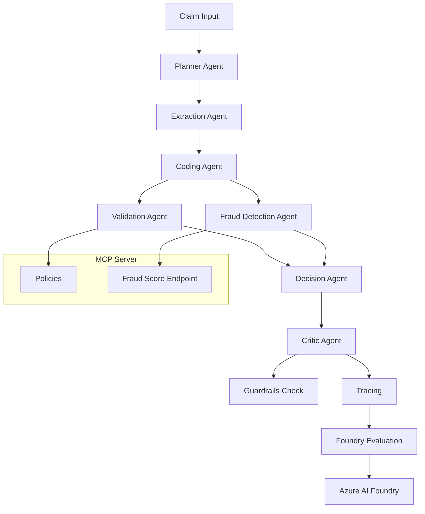

# AgenticClaimsProcessing

## Overview

AgenticClaimsProcessing is a production-style healthcare claims processing and fraud detection system built on Azure AI Foundry. It demonstrates a complete multi-agent orchestration design using Foundry-native LLM deployment, centralized policy rules, fraud RAG, and enterprise-grade observability.

The system is intended for engineering and instructional use, with a clean folder structure, clear separation of concerns, and a deployable pipeline for claims ingestion, coding, validation, fraud detection, decisioning, and evaluation.

## What this project does

- Ingests healthcare claims as JSON or document-based submissions.
- Extracts structured claim data via document intelligence.
- Maps services to ICD/CPT codes using Foundry-hosted GPT-4o reasoning.
- Validates claims against MCP-served policy rules and constraints.
- Detects fraud through an external fraud scoring API.
- Makes a final decision: Approve, Reject, or Flag for Review.
- Reviews quality and safety through Foundry Guardrails.
- Logs traces and stores results in an Output folder.

## Architecture



## Core Components

### Agents

- `Planner Agent` — builds the orchestration path.
- `Extraction Agent` — normalizes raw claim data.
- `Coding Agent` — maps service descriptions to ICD/CPT.
- `Validation Agent` — applies MCP policies.
- `Fraud Detection Agent` — applies fraud scoring.
- `Decision Agent` — selects final outcome.
- `Critic Agent` — applies guardrail and quality review.
- `Evaluation Agent` — evaluates outcomes.

### Tooling

- `app/tools/foundry_sdk.py` — logs traces and evaluations to Foundry.
- `app/tools/foundry_guardrails.py` — executes Foundry guardrail evaluations.
- `app/tools/openai_client.py` — invokes Azure AI Services-hosted OpenAI deployment.
- `app/tools/document_intelligence.py` — uses Foundry-hosted Document Intelligence.
- `app/tools/rules_engine.py` — fetches MCP policy and validates claims.
- `app/tools/external_fraud_api.py` — sends claim data to the fraud scoring endpoint.

### MCP Server

- `app/mcp/server.py` — serves policy rules and a local fraud score endpoint.
- `app/mcp/policies.py` — defines policy bundles and rules.
- `app/mcp/schemas.py` — Pydantic models for policies and fraud scoring.

### Evaluation

- `app/evaluations/evaluator.py` — computes groundedness, relevance, safety, and fraud confidence metrics.

## Repository Structure

- `app/` — main application package.
- `app/agents/` — agent definitions and workflow orchestration.
- `app/tools/` — service connectors and Azure integration clients.
- `app/mcp/` — policy and MCP server logic.
- `app/evaluations/` — evaluation pipeline.
- `app/data/sample/` — sample claim data.
- `scripts/` — starter scripts for local execution and setup.
- `.env.example` — configuration template.
- `requirements.txt` — Python dependencies.

## Required Azure Resources

- Azure AI Foundry project
- Azure AI Services endpoint for OpenAI and Search with Azure AD auth
- Azure AI Foundry endpoint for guardrail evaluation and agent registration
- Azure Document Intelligence endpoint for document extraction
- Optional: Foundry Guardrails configured in the Foundry project

## Environment Configuration

Create `.env` from `.env.example` and populate:

```text
AZURE_AI_SERVICES_ENDPOINT=https://<your-ai-services-endpoint>.cognitiveservices.azure.com/
AZURE_OPENAI_DEPLOYMENT=gpt-4o
AZURE_SEARCH_ENDPOINT=https://<your-search-service>.search.windows.net
AZURE_SEARCH_INDEX=healthcare-fraud-index
AZURE_FOUNDRY_ENDPOINT=https://<your-project-name>.services.ai.azure.com/api/projects/<project-name>
AZURE_FOUNDRY_PROJECT_ID=<your-foundry-project-id>
AZURE_FOUNDRY_SCOPE=https://cognitiveservices.azure.com/.default
AZURE_FOUNDRY_AGENT_VERSION=1
AZURE_DOCUMENT_INTELLIGENCE_ENDPOINT=https://<your-document-intelligence-instance>.services.ai.azure.com/
AZURE_DOCUMENT_INTELLIGENCE_KEY_SECRET_NAME=AzureDocumentIntelligenceKey
AZURE_KEY_VAULT_URL=https://<your-key-vault-name>.vault.azure.net/
AZURE_KEY_VAULT_CLIENT_ID=
AZURE_OPENAI_KEY_SECRET_NAME=AzureOpenAIKey
AZURE_FORM_RECOGNIZER_KEY_SECRET_NAME=AzureFormRecognizerKey
AZURE_SEARCH_KEY_SECRET_NAME=AzureSearchKey
AZURE_FOUNDRY_KEY_SECRET_NAME=AzureFoundryKey
FRAUD_API_URL=http://127.0.0.1:8000/fraud-score
FRAUD_API_KEY=
MCP_HOST=127.0.0.1
MCP_PORT=8000
LOG_LEVEL=INFO
ENVIRONMENT=development
```

This project is designed to authenticate to Azure services using managed identity for Azure Key Vault access. If you are using a user-assigned managed identity, set `AZURE_KEY_VAULT_CLIENT_ID`; otherwise leave it blank for system-assigned managed identity. For local development when managed identity is unavailable, the code falls back to Azure CLI authentication, so run `az login` first.

## Execution Checklist

1. Install dependencies.
2. Configure `.env`.
3. Start the MCP server.
4. Register agents in Foundry (optional but recommended).
5. Execute a claim through the orchestrator.
6. Run the evaluation pipeline.

## Step-by-Step Run Instructions

## 1. Creating Virtual Environment and Installing all dependencies - Step by step instructions

### Open the Terminal in VS Code:

In your Codespace, open the integrated terminal (View > Terminal or Ctrl+`).
Navigate to Your Project Root (if not already there):

cd /workspaces/AgenticClaimsProcessing

### Create the Virtual Environment:

Run the following command to create a virtual environment named .venv in your project folder:

python -m venv .venv

This creates a .venv/ directory in your project root with the isolated environment.

### Activate the Virtual Environment:

source .venv/bin/activate

Your terminal prompt should now show (.venv) at the beginning, indicating it's active.

### Install Dependencies (if applicable):

Run following command to install all dependencies - 

pip install -r requirements.txt

### Deactivate When Done (optional):

To exit the virtual environment:

deactivate

## Additional Notes
1. The .venv/ folder should be added to your .gitignore to avoid committing it to Git.
2. In GitHub Codespaces, Python 3 is typically pre-installed, but if you encounter issues, run python --version to confirm.
---------------------------------------------------------------------------------------

### Install Azure CLI 

Run following command in terminal after activating your .venv

curl -sL https://aka.ms/InstallAzureCLIDeb | sudo bash

Check the installed version of az

az version

Once the above command shows azure-cli version, type in below command 

az login

This will open a browser and ask you to sign in by pasting the code which it generates and then caches the credentials locally.
---------------------------------------------------------------------------------------
### 2. Configure `.env`

Copy `.env.example` to `.env` and update values for your environment.

### 3. Start the local MCP server

```bash
python scripts/run_mcp.py
```

This server exposes:
- `GET /policies`
- `GET /constraints`
- `GET /allowed-procedures`
- `POST /fraud-score`
- `GET /health`

### 4. Register agents in Foundry

```bash
python scripts/deploy_foundry_agents.py
```

If your Foundry project already has agents registered, this step verifies and registers the same named agent definitions.

### 5. Run claim processing locally

```bash
python scripts/run_local.py
```

This executes the full end-to-end workflow using `app/data/sample/claim_sample.json`.

### 6. Run evaluation

```bash
python scripts/eval_run.py
```

This computes the evaluation metrics and stores them in Foundry.

## Execution Notes

- The LLM client is Foundry-only and invokes the deployed model via `app/tools/openai_client.py`.
- The system logs processing traces and evaluation data back into the Foundry project via `app/tools/foundry_sdk.py`.
- The MCP server is the single source of truth for policy rules and local mock fraud scoring.
- Sample claim data is available at `app/data/sample/claim_sample.json`.

## Student Guidance

This repository is designed to teach enterprise-grade GenAI architecture:
- multi-agent decomposition
- external policy service integration
- RAG-based fraud retrieval
- Foundry-native LLM invocation
- Responsible AI guardrails and audit logging
- evaluation metrics stored in Foundry

Students should explore:
- `app/agents/orchestrator.py`
- `app/mcp/server.py`
- `app/tools/openai_client.py`
- `app/tools/foundry_guardrails.py`
- `app/evaluations/evaluator.py`

## Additional References

- `requirements.txt` for dependency installation
- `scripts/run_mcp.py` to start policy service
- `scripts/deploy_foundry_agents.py` to register agents
- `scripts/run_local.py` for end-to-end processing
- `scripts/eval_run.py` for evaluation review

## Final Validation

The codebase has been validated via Python compilation after cleanup.

## One-Page Handout

### Essential Architecture

- `Planner Agent` → selects workflow steps
- `Extraction Agent` → claim ingestion and normalization
- `Coding Agent` → ICD/CPT mapping via Foundry LLM
- `Validation Agent` → MCP policy rules enforcement
- `Fraud Detection Agent` → Azure Search + fraud score
- `Decision Agent` → approve/reject/flag decision
- `Critic Agent` → Foundry guardrail safety review
- `Trace & Evaluation` → logged to Azure AI Foundry

### Required Azure Resources

- Azure AI Foundry project
- Foundry-hosted LLM deployment (`gpt-4o`)
- Azure Document Intelligence resource
- Azure Cognitive Search service + index
- Azure AI Foundry Guardrails enabled

### Quick Start Commands

```bash
python -m pip install -r requirements.txt
cp .env.example .env
# update .env with Foundry and Azure values
python scripts/run_mcp.py
python scripts/deploy_foundry_agents.py
python scripts/run_local.py
python scripts/eval_run.py
```

### Key Files

- `app/agents/orchestrator.py`
- `app/tools/openai_client.py`
- `app/tools/foundry_guardrails.py`
- `app/mcp/server.py`
- `scripts/run_local.py`
- `scripts/run_mcp.py`
- `scripts/eval_run.py`

### Student Checklist

- [ ] Configure `.env` correctly
- [ ] Start MCP server
- [ ] Register agents in Foundry
- [ ] Execute claim orchestration
- [ ] Review Foundry trace and evaluation output

### Steps to test MCP server via MCP Inspector through CLI - 

When you run, run_mcp , it runs your Fast API MCP app on your localhost which is forwarded to a Git hub external host by default (when using Github Codespace).

Make sure the port, 8000 is set to "Public" under "Ports" in the terminal for "Visibility" feature.

1. Install MCP inspector by running following command in bash terminal

npm install -g @modelcontextprotocol/inspector

2. Once installed, run following terminal command to list all Tools of MCP server - 

Please note for all the below URL, you may also replace your localhost with auto-forwarded address as well.
In this case, 
http://127.0.0.1:8000 (local)
has corrosponding following forwaded address:
https://urban-disco-g4g7wppxr673pw79-8000.app.github.dev/


mcp-inspector http://127.0.0.1:8000/mcp --cli --transport http --method tools/list

OR 

mcp-inspector https://urban-disco-g4g7wppxr673pw79-8000.app.github.dev/mcp --cli --transport http --method tools/list

3. Call the tool - 

mcp-inspector http://127.0.0.1:8000/mcp --cli --transport http --method tools/call --tool-name get_policies_policies_get

mcp-inspector http://127.0.0.1:8000/mcp --cli --transport http --method tools/call --tool-name get_constraints_constraints_get

mcp-inspector http://127.0.0.1:8000/mcp --cli --transport http --method tools/call --tool-name get_allowed_procedures_allowed_procedures_get

mcp-inspector http://127.0.0.1:8000/mcp --cli --transport http --method tools/call --tool-name fraud_score_fraud_score_post --tool-arg claim_id=CLAIM-1001 --tool-arg items='[{"procedure_code":"99213","amount":120.0,"provider":"P-12345", "diagnosis": "Liver Culture"}]'


### Steps to test MCP server via MCP Inspector UI - 
Open a second terminal and run:

mcp-inspector --transport http --server-url https://urban-disco-g4g7wppxr673pw79-8000.app.github.dev/mcp

If the above command errors out with busy port, run below command - 

CLIENT_PORT=6275 SERVER_PORT=6278 mcp-inspector --transport http --server-url http://127.0.0.1:8000/mcp